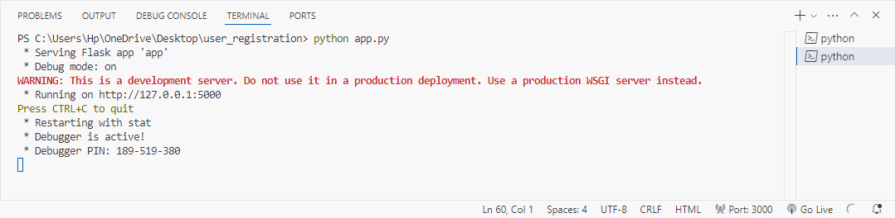
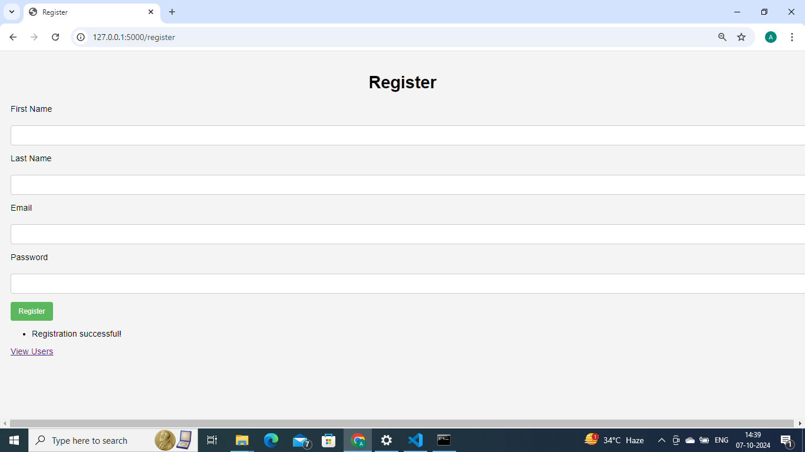
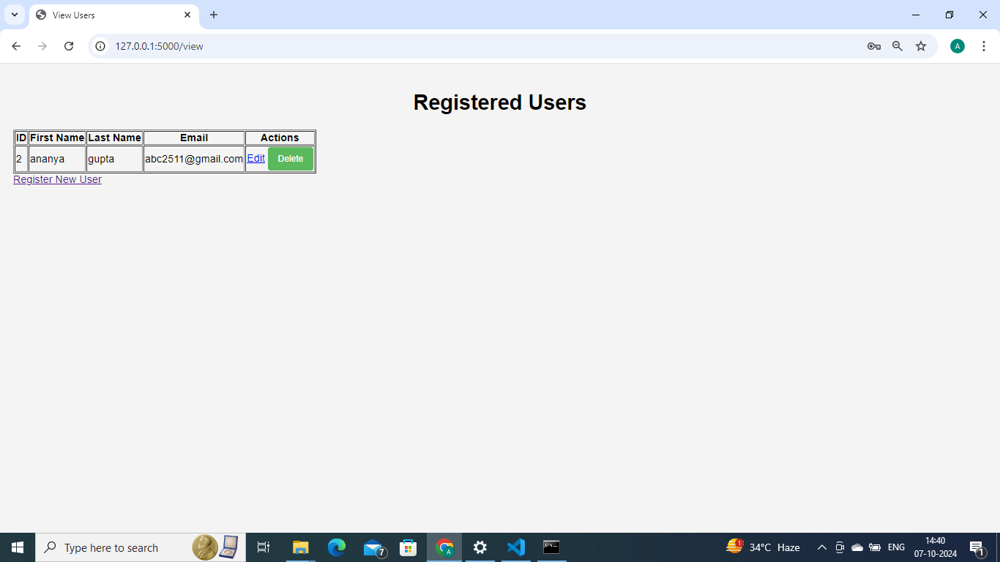

# SQL-user-registration
 Building a User Registration System with CRUD (Create, Read, Update, Delete) operations using Python, Flask, MySQL, and HTML/CSS/JavaScript 
## Technologies Used:
* Backend: Python with Flask
* Database: MySQL
* Frontend: HTML, CSS, JavaScript
## Tools Needed:
* Python installed on your machine
* MySQL installed and running
* Text Editor/IDE (e.g., VS Code, PyCharm)
* Postman (optional, for API testing)
* pip (Python package manager)
### Step 1: Set Up Your Development Environment
#### 1.1 Install Required Software
* Python:

Download and install Python from [python.org][python].
Ensure that Python is added to your system's PATH during installation.
* MySQL:

Download and install MySQL from [mysql.com][sql].
During installation, set up a root password that you will remember.
MySQL Workbench (Optional but recommended):

Provides a graphical interface to manage your MySQL databases.
Download from mysql.com.
* Text Editor/IDE:

* Install a text editor like Visual Studio Code (VS Code) from [code.visualstudio.com][vscode].
### 1.2 Install Python Packages
Open your terminal or command prompt and install the following packages using pip:
```
pip install flask mysql-connector-python flask-wtf
```
* Flask: A lightweight WSGI web application framework.
* mysql-connector-python: MySQL driver written in Python.
* Flask-WTF: Integrates WTForms with Flask for form handling and validation.
### Step 2: Create the MySQL Database and Table
### 2.1 Access MySQL
Using MySQL Workbench:

Open MySQL Workbench.
Connect to your local MySQL server using the root credentials.
Using Command Line:

Open your terminal or command prompt.
#### Connect to MySQL:
```
mysql -u root -p
Enter your root password when prompted.
```
#### 2.2 Create the Database and users Table
Run the following SQL commands to set up the database and table:

### sql
```
-- Create the database
CREATE DATABASE user_db;

-- Switch to the database
USE user_db;

-- Create the users table
CREATE TABLE users (
    id INT AUTO_INCREMENT PRIMARY KEY,
    first_name VARCHAR(50) NOT NULL,
    last_name VARCHAR(50) NOT NULL,
    email VARCHAR(100) NOT NULL UNIQUE,
    password VARCHAR(255) NOT NULL,
    registration_date TIMESTAMP DEFAULT CURRENT_TIMESTAMP
);
```
### Step 3: Set Up the Project Structure
#### 3.1 Create Project Directory
Navigate to Your Development Folder:

+ Choose a location on your computer where you want to store the project.
+ Create a New Folder:
 
** Name it user_registration.** 
#### 3.2 Project Folder Structure
Your user_registration folder should have the following structure:
```
user_registration/
├── app.py
├── templates/
│   ├── register.html
│   ├── view.html
│   ├── edit.html
├── static/
│   ├── styles.css
└── requirements.txt
```
+ app.py: The main Flask application file.
+ templates/: Folder containing HTML templates.
+ static/: Folder for static files like CSS and JavaScript.
+ requirements.txt: Lists Python dependencies (optional but recommended).
### Step 4: Initialize the Flask Application
#### 4.1 Create app.py
**Open your text editor, navigate to the user_registration folder, and create a file named app.py. Add the code** 

Password Hashing: Uses generate_password_hash from werkzeug.security to securely hash passwords before storing them.
### Step 5: Create HTML Templates
#### 5.1 Registration Page (register.html)
Create a register.html file inside the templates folder.

#### 5.2 View Users Page (view.html)
**Create a view.html file inside the templates folder.**

* User Table: Displays all registered users with options to Edit or Delete.
* Delete Confirmation: JavaScript confirm dialog to prevent accidental deletions.
* Styling: Bootstrap classes for a clean table layout.
#### 5.3 Edit User Page (edit.html)
**Create an edit.html file inside the templates folder.**

### Step 6: Add CSS Styling
#### 6.1 Create styles.css
* Create a styles.css file inside the static folder for any additional custom styles. For this project, since we're using Bootstrap, additional CSS is optional, but you can add custom styles as needed.
### Step 7: Run the Flask Application
#### 7.1 Set Environment Variables (Optional for Development)
For development purposes, you can set environment variables to enable debug mode.
On Windows:

```
set FLASK_APP=app.py
set FLASK_ENV=development
```

#### 7.2 Run the Application
**Navigate to your project directory in the terminal and run:**

```
python app.py
```
Output:

You should see output similar to:
```
* Running on http://127.0.0.1:5000/ (Press CTRL+C to quit)
 * Restarting with stat
 * Debugger is active!
 * Debugger PIN: 123-456-789
```


#### 7.3 Access the Application

**Open your web browser and navigate to http://localhost:5000/register to access the registration form.**





[sql]:https://www.mysql.com/
[vscode]: https://code.visualstudio.com/
[python]: https://www.python.org/
